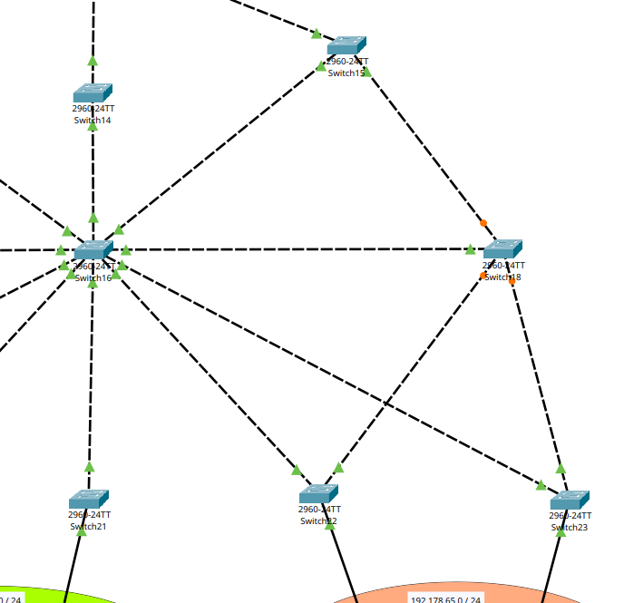
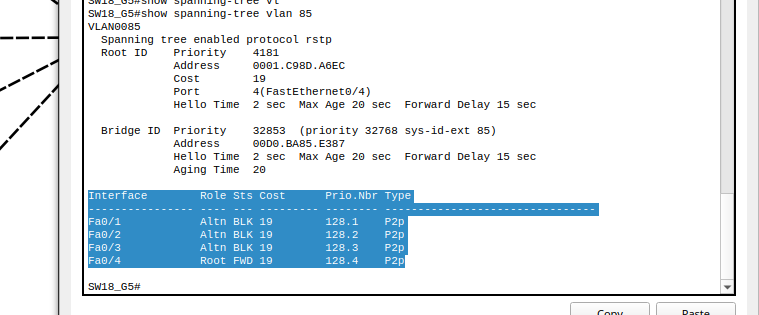
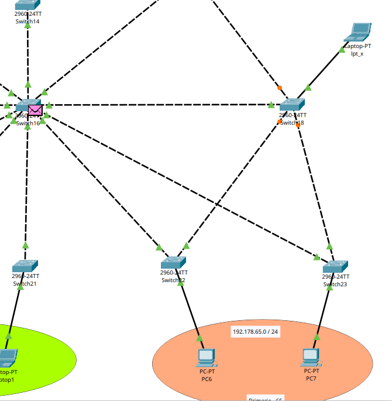
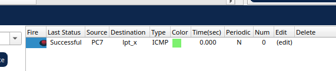
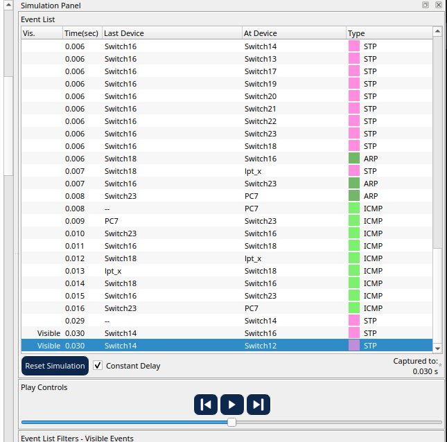
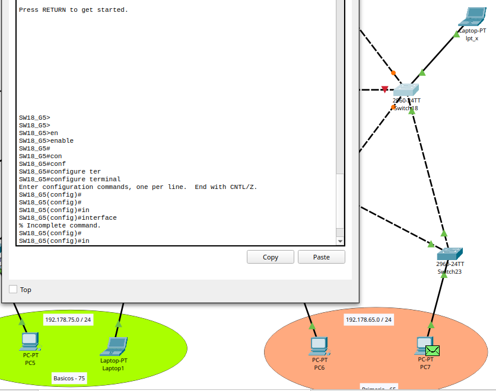
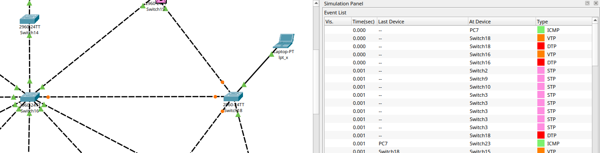
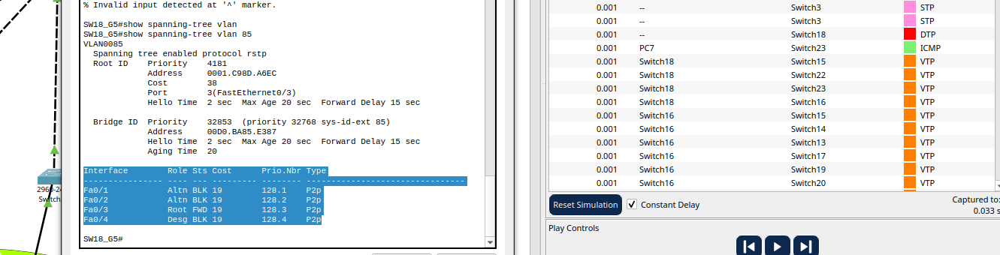
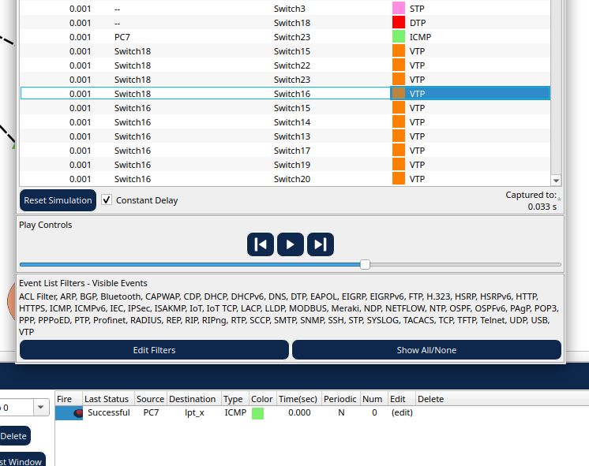

# edificio Derecho

# switch 16 -> switch mode server (VTP)
```Cisco
enable
	config terminal
		hostname SW16_G5

		# creacion de SW server - vtp
		vtp mode server
		vtp version 2
		vtp domain G5

		# creacion de vlan 
		vlan 85
			name bachillerato_der
			exit

		vlan 75 
			name basicos_der
			exit

		vlan 65
			name primaria_der
			exit

		# configuracion de puertos a trunk
		interface range FastEthernet0/1 - 10
			switchport mode trunk
			switchport trunk allowed vlan 85,75,65
			no shutdown
			exit

		exit

	write

```


## Confirmacion del SW server:

show vtp status:

```bash
SW16_G5#show vtp status 
VTP Version capable             : 1 to 2
VTP version running             : 2
VTP Domain Name                 : G5
VTP Pruning Mode                : Disabled
VTP Traps Generation            : Disabled
Device ID                       : 000A.F320.7C00
Configuration last modified by 0.0.0.0 at 3-2-93 12:22:36
Local updater ID is 0.0.0.0 (no valid interface found)

Feature VLAN : 
--------------
VTP Operating Mode                : Server
Maximum VLANs supported locally   : 255
Number of existing VLANs          : 8
Configuration Revision            : 6
MD5 digest                        : 0xAA 0x6B 0x64 0xB4 0xBE 0x61 0x11 0x82 
                                    0x21 0x60 0xF5 0x51 0x0D 0x77 0x8A 0xC3 
SW16_G5#


```


## confirmacion de la creacion de vlans:
show vlan brief:

```bash
SW16_G5#show vlan brief 

VLAN Name                             Status    Ports
---- -------------------------------- --------- -------------------------------
1    default                          active    Fa0/1, Fa0/2, Fa0/3, Fa0/4
                                                Fa0/5, Fa0/6, Fa0/7, Fa0/8
                                                Fa0/9, Fa0/10, Fa0/11, Fa0/12
                                                Fa0/13, Fa0/14, Fa0/15, Fa0/16
                                                Fa0/17, Fa0/18, Fa0/19, Fa0/20
                                                Fa0/21, Fa0/22, Fa0/23, Fa0/24
                                                Gig0/1, Gig0/2
65   primaria_der                     active    
75   basicos_der                      active    
85   bachillerato_der                 active    
1002 fddi-default                     active    
1003 token-ring-default               active    
1004 fddinet-default                  active    
1005 trnet-default                    active    
SW16_G5#

```


## confirmacion de las interface:
show interface status:
```bash
SW16_G5#show interfaces status 
Port      Name               Status       Vlan       Duplex  Speed Type
Fa0/1                        connected    trunk      a-full  a-100 10/100BaseTX
Fa0/2                        connected    trunk      a-full  a-100 10/100BaseTX
Fa0/3                        connected    trunk      a-full  a-100 10/100BaseTX
Fa0/4                        connected    trunk      a-full  a-100 10/100BaseTX
Fa0/5                        connected    trunk      a-full  a-100 10/100BaseTX
Fa0/6                        connected    trunk      a-full  a-100 10/100BaseTX
Fa0/7                        connected    trunk      a-full  a-100 10/100BaseTX
Fa0/8                        connected    trunk      a-full  a-100 10/100BaseTX
Fa0/9                        connected    trunk      a-full  a-100 10/100BaseTX
Fa0/10                       connected    trunk      a-full  a-100 10/100BaseTX
Fa0/11                       notconnect   1          auto    auto  10/100BaseTX
Fa0/12                       notconnect   1          auto    auto  10/100BaseTX
Fa0/13                       notconnect   1          auto    auto  10/100BaseTX
Fa0/14                       notconnect   1          auto    auto  10/100BaseTX
Fa0/15                       notconnect   1          auto    auto  10/100BaseTX
Fa0/16                       notconnect   1          auto    auto  10/100BaseTX
Fa0/17                       notconnect   1          auto    auto  10/100BaseTX
Fa0/18                       notconnect   1          auto    auto  10/100BaseTX
Fa0/19                       notconnect   1          auto    auto  10/100BaseTX
Fa0/20                       notconnect   1          auto    auto  10/100BaseTX
Fa0/21                       notconnect   1          auto    auto  10/100BaseTX
Fa0/22                       notconnect   1          auto    auto  10/100BaseTX
Fa0/23                       notconnect   1          auto    auto  10/100BaseTX
Fa0/24                       notconnect   1          auto    auto  10/100BaseTX
Gig0/1                       notconnect   1          auto    auto  10/100/1000BaseTX
Gig0/2                       notconnect   1          auto    auto  10/100/1000BaseTX

SW16_G5#
```


# Switch Clientes protocolo VTP.

	* SW12_G5
	* SW13_G5
	* SW14_G5
	* SW15_G5
	* SW17_G5
	* SW18_G5
	* SW19_G5
	* SW20_G5
	* SW21_G5
	* SW22_G5
	* SW23_G5

```Cisco
enable
	config terminal
		hostname SW14_G5

		# configuracion para SW cliente
		vtp mode client
		vtp version 2
		vtp domain G5 

		# configuracion para interfaces
		interface range FastEthernet0/1-4
			switchport mode trunk
			switchport trunk allowed vlan 85,75,65
			exit


		exit
	write

```	


## verificar que este en VTP mode client:
```bash
SW14_G5#show vtp status
VTP Version capable             : 1 to 2
VTP version running             : 2
VTP Domain Name                 : G5
VTP Pruning Mode                : Disabled
VTP Traps Generation            : Disabled
Device ID                       : 0009.7C45.BB00
Configuration last modified by 0.0.0.0 at 3-2-93 11:48:14

Feature VLAN : 
--------------
VTP Operating Mode                : Client
Maximum VLANs supported locally   : 255
Number of existing VLANs          : 8
Configuration Revision            : 6
MD5 digest                        : 0xBB 0x24 0xBE 0xD2 0x40 0xF5 0xA7 0x5E 
                                    0xB1 0x14 0x55 0x9D 0xF0 0x16 0xFC 0xBD 
SW14_G5#
```

## verficar que lleguen las vlan del switch server:
```bash
SW14_G5#show vlan brief 

VLAN Name                             Status    Ports
---- -------------------------------- --------- -------------------------------
1    default                          active    Fa0/3, Fa0/4, Fa0/5, Fa0/6
                                                Fa0/7, Fa0/8, Fa0/9, Fa0/10
                                                Fa0/11, Fa0/12, Fa0/13, Fa0/14
                                                Fa0/15, Fa0/16, Fa0/17, Fa0/18
                                                Fa0/19, Fa0/20, Fa0/21, Fa0/22
                                                Fa0/23, Fa0/24, Gig0/1, Gig0/2
65   primaria_der                     active    
75   basicos_der                      active    
85   bachillerato_der                 active    
1002 fddi-default                     active    
1003 token-ring-default               active    
1004 fddinet-default                  active    
1005 trnet-default                    active    
SW14_G5#
```


# Configuracion del resto de switch en modo cliente


## Switch SW12_G5 cliente

```Cisco
enable
	configure terminal
		hostname SW12_G5


		vtp mode client
 		vtp version 2
 		vtp domain G5 

 		interface range FastEthernet0/1-4
  			switchport mode trunk
  			switchport trunk allowed vlan 85,75,65
 			exit

		interface gigabitEthernet 0/1
			switchport mode trunk
			switchport trunk allowed vlan 10,20,30
			no shutdown
			exit 
		exit
	write
```

---

## Switch SW13_G5 cliente

```Cisco
enable
	configure terminal
 		hostname SW13_G5

		vtp mode client
		vtp version 2
		vtp domain G5 

		interface range FastEthernet0/1-4
 			switchport mode trunk
  			switchport trunk allowed vlan 85,75,65
 			exit

		exit
	write
```

---

# Switch SW14_G5 cliente

```Cisco
enable
	configure terminal
		hostname SW14_G5

		vtp mode client
		vtp version 2
		vtp domain G5 

		interface range FastEthernet0/1-4
			switchport mode trunk
			switchport trunk allowed vlan 85,75,65
			exit

		exit
	write
```

---

# Switch SW15_G5 cliente

```Cisco
enable
	configure terminal
		hostname SW15_G5

		vtp mode client
		vtp version 2
		vtp domain G5 

		interface range FastEthernet0/1-4
			switchport mode trunk
			switchport trunk allowed vlan 85,75,65
			exit

		exit
	write
```

---

# Switch SW17_G5 cliente

```Cisco
enable
	configure terminal
		hostname SW17_G5

		vtp mode client
		vtp version 2
		vtp domain G5 

		interface range FastEthernet0/1-4
			switchport mode trunk
			switchport trunk allowed vlan 85,75,65
			exit

		exit
	write
```

---

# Switch SW18_G5 cliente

```Cisco
enable
	configure terminal
		hostname SW18_G5

		vtp mode client
		vtp version 2
		vtp domain G5 

		interface range FastEthernet0/1-4
			switchport mode trunk
			switchport trunk allowed vlan 85,75,65
			exit

		exit
	write
```

---

# Switch SW19_G5 cliente + mode access vlan respectiva

```Cisco
enable
	configure terminal
		hostname SW19_G5

		vtp mode client
		vtp version 2
		vtp domain G5 

		interface range FastEthernet0/1-4
			switchport mode trunk
			switchport trunk allowed vlan 85,75,65
			exit

		interface FastEthernet 0/11
			switchport mode access
			switchport access vlan 85
			no shutdown
			exit 

		exit
	write
```

## verificar que la interface tenga acceso a la vlan respectiva
```bash
SW19_G5#show interfaces status 
Port      Name               Status       Vlan       Duplex  Speed Type
Fa0/1                        connected    trunk      a-full  a-100 10/100BaseTX
Fa0/2                        connected    trunk      a-full  a-100 10/100BaseTX
Fa0/3                        notconnect   trunk      auto    auto  10/100BaseTX
Fa0/4                        notconnect   trunk      auto    auto  10/100BaseTX
Fa0/5                        notconnect   1          auto    auto  10/100BaseTX
(...)
Fa0/9                        notconnect   1          auto    auto  10/100BaseTX
Fa0/10                       notconnect   1          auto    auto  10/100BaseTX
Fa0/11                       connected    85         a-full  a-100 10/100BaseTX
Fa0/12                       notconnect   1          auto    auto  10/100BaseTX
Fa0/13                       notconnect   1          auto    auto  10/100BaseTX
Fa0/14                       notconnect   1          auto    auto  10/100BaseTX
Fa0/15                       notconnect   1          auto    auto  10/100BaseTX
(...)
Fa0/24                       notconnect   1          auto    auto  10/100BaseTX
Gig0/1                       notconnect   1          auto    auto  10/100/1000BaseTX

SW19_G5#

```

---

# Switch SW20_G5 cliente

```Cisco
enable
	configure terminal
		hostname SW20_G5

		vtp mode client
		vtp version 2
		vtp domain G5 

		interface range FastEthernet0/1-4
			switchport mode trunk
			switchport trunk allowed vlan 85,75,65
			exit

		interface FastEthernet 0/11
			switchport mode access
			switchport access vlan 75
			no shutdown
			exit 
		exit
	write
```

---

# Switch SW21_G5 cliente

```Cisco
enable
	configure terminal
		hostname SW21_G5

		vtp mode client
		vtp version 2
		vtp domain G5 

		interface range FastEthernet0/1-4
			switchport mode trunk
			switchport trunk allowed vlan 85,75,65
			exit

		interface FastEthernet 0/11
			switchport mode access
			switchport access vlan 75
			no shutdown
			exit 

		exit
	write
```

---

# Switch SW22_G5 cliente

```Cisco
enable
	configure terminal
		hostname SW22_G5

		vtp mode client
		vtp version 2
		vtp domain G5 

		interface range FastEthernet0/1-4
			switchport mode trunk
			switchport trunk allowed vlan 85,75,65
			exit


		interface FastEthernet 0/11
			switchport mode access
			switchport access vlan 65
			no shutdown
			exit 

		exit
	write
```

---

# Switch SW23_G5 cliente

```Cisco
enable
	configure terminal
		hostname SW23_G5

		vtp mode client
		vtp version 2
		vtp domain G5 

		interface range FastEthernet0/1-4
			switchport mode trunk
			switchport trunk allowed vlan 85,75,65
			exit

		interface FastEthernet 0/11
			switchport mode access
			switchport access vlan 65
			no shutdown
			exit 

		exit
	write
```


# configuracion de IP
	PC4 -: 192.178.85.11
	default gateway: 192.178.85.1

	PC5 -: 192.178.75.11
	laptop1 -: 192.178.75.12
	default gateway: 192.178.75.1

	PC6 -: 192.178.65.11
	PC7 -: 192.178.65.12
	default gateway: 192.178.65.1


# Port Security
## direcciones mac-address
	* PC4 -: 0002.4AA1.31BB

	* PC5 -: 0004.9ADA.A0E8
	* laptop1 -: 0001.9736.0902

	* PC6 -: 0060.2FB1.E768
	* PC7 -: 000D.BD42.0932

### PC 4 - port-security
```Cisco
enable
	configure terminal
		interface FastEthernet0/11
			switchport port-security
			switchport port-security Maximum 1
			switchport port-security violation shutdown
			switchport port-security mac-address 0002.4AA1.31BB
			no shutdown
			exit

		exit 
	write

```

### verificar que se activo `show port-security interface FastEthernet0/11`:
```bash
SW19_G5#
	SW19_G5#show port-security interface FastEthernet0/11
	Port Security              : Enabled
	Port Status                : Secure-up
	Violation Mode             : Shutdown
	Aging Time                 : 0 mins
	Aging Type                 : Absolute
	SecureStatic Address Aging : Disabled
	Maximum MAC Addresses      : 1
	Total MAC Addresses        : 1
	Configured MAC Addresses   : 1
	Sticky MAC Addresses       : 0
	Last Source Address:Vlan   : 0000.0000.0000:0
	Security Violation Count   : 0

SW19_G5#

```

### ejemplo en un puerto que no esta activad `show port-security interface FastEthernet0/12`:

```bash
SW19_G5#show port-security interface FastEthernet0/12
	Port Security              : Disabled
	Port Status                : Secure-down
	Violation Mode             : Shutdown
	Aging Time                 : 0 mins
	Aging Type                 : Absolute
	SecureStatic Address Aging : Disabled
	Maximum MAC Addresses      : 1
	Total MAC Addresses        : 0
	Configured MAC Addresses   : 0
	Sticky MAC Addresses       : 0
	Last Source Address:Vlan   : 0000.0000.0000:0
	Security Violation Count   : 0
SW19_G5#
```


## Port Security para el resto de switch 20, 21, 22, 23:
```Cisco

# pc5 - sw20
enable
	configure terminal
		interface FastEthernet0/11
			switchport port-security
			switchport port-security Maximum 1
			switchport port-security violation shutdown
			switchport port-security mac-address 0004.9ADA.A0E8
			no shutdown
			exit

		exit 
	write


# laptop1 - sw21
enable
	configure terminal
		interface FastEthernet0/11
			switchport port-security
			switchport port-security Maximum 1
			switchport port-security violation shutdown
			switchport port-security mac-address 0001.9736.0902
			no shutdown
			exit

		exit 
	write


# PC6 - sw22
enable
	configure terminal
		interface FastEthernet0/11
			switchport port-security
			switchport port-security Maximum 1
			switchport port-security violation shutdown
			switchport port-security mac-address 0060.2FB1.E768
			no shutdown
			exit

		exit 
	write


# PC7 - sw23
enable
	configure terminal
		interface FastEthernet0/11
			switchport port-security
			switchport port-security Maximum 1
			switchport port-security violation shutdown
			switchport port-security mac-address 000D.BD42.0932
			no shutdown
			exit

		exit 
	write
```


# Protocolo STP:

En la topologia actual del edificio derecho el `SW19_G5` es el actual bridge root, el que esta conectado al PC4:

```bash
SW19_G5#show spanning-tree
VLAN0001
  Spanning tree enabled protocol ieee
  Root ID    Priority    32769
             Address     0001.6332.A29C
             This bridge is the root
             Hello Time  2 sec  Max Age 20 sec  Forward Delay 15 sec

  Bridge ID  Priority    32769  (priority 32768 sys-id-ext 1)
             Address     0001.6332.A29C
             Hello Time  2 sec  Max Age 20 sec  Forward Delay 15 sec
             Aging Time  20

Interface        Role Sts Cost      Prio.Nbr Type
---------------- ---- --- --------- -------- --------------------------------
Fa0/1            Desg FWD 19        128.1    P2p
Fa0/2            Desg FWD 19        128.2    P2p


```


vamos a aplicar el Rapid Spanning tree (RSTP) y reubicar el root Brige a el SW16_G5

# Rapid STP:

## SW16_G5 -> nuevo root Brige para las vlan 65, 75, 85

```Cisco 
enable
	config terminal

	spanning-tree mode rapid-pvst
	spanning-tree vlan 65,75,85 priority 4096 # o en vez de "priority 4096" poner "root primary"
	
	exit 
write
```

### confirmamos con show spanning-tree:
```bash

SW16_G5#show spanning-tree 
VLAN0001
	  Spanning tree enabled protocol rstp
	  Root ID    Priority    32769
	             Address     0001.6332.A29C
	             Cost        19
	             Port        5(FastEthernet0/5)
	             Hello Time  2 sec  Max Age 20 sec  Forward Delay 15 sec

	  Bridge ID  Priority    32769  (priority 32768 sys-id-ext 1)
	             Address     0001.C98D.A6EC
	             Hello Time  2 sec  Max Age 20 sec  Forward Delay 15 sec
	             Aging Time  20

	Interface        Role Sts Cost      Prio.Nbr Type
	---------------- ---- --- --------- -------- --------------------------------
	Fa0/1            Desg LRN 19        128.1    P2p
	Fa0/2            Desg LRN 19        128.2    P2p
	Fa0/3            Desg LRN 19        128.3    P2p
	Fa0/4            Desg LRN 19        128.4    P2p
	Fa0/5            Root FWD 19        128.5    P2p
	Fa0/6            Desg LRN 19        128.6    P2p
	Fa0/7            Desg LRN 19        128.7    P2p
	Fa0/8            Desg LRN 19        128.8    P2p
	Fa0/9            Desg LRN 19        128.9    P2p
	Fa0/10           Desg LRN 19        128.10   P2p

VLAN0065
		  Spanning tree enabled protocol rstp
		  Root ID    Priority    4161
		             Address     0001.C98D.A6EC
		             This bridge is the root
		             Hello Time  2 sec  Max Age 20 sec  Forward Delay 15 sec

		  Bridge ID  Priority    4161  (priority 4096 sys-id-ext 65)
		             Address     0001.C98D.A6EC
		             Hello Time  2 sec  Max Age 20 sec  Forward Delay 15 sec
		             Aging Time  20

		Interface        Role Sts Cost      Prio.Nbr Type
		---------------- ---- --- --------- -------- --------------------------------
		Fa0/1            Desg FWD 19        128.1    P2p
		Fa0/2            Desg FWD 19        128.2    P2p
		Fa0/3            Desg FWD 19        128.3    P2p
		Fa0/4            Desg FWD 19        128.4    P2p
		Fa0/5            Desg FWD 19        128.5    P2p
		Fa0/6            Desg FWD 19        128.6    P2p
		Fa0/7            Desg LRN 19        128.7    P2p
		Fa0/8            Desg FWD 19        128.8    P2p
		Fa0/9            Desg FWD 19        128.9    P2p
		Fa0/10           Desg FWD 19        128.10   P2p

VLAN0075
		  Spanning tree enabled protocol rstp
		  Root ID    Priority    4171
		             Address     0001.C98D.A6EC
		             This bridge is the root
		             Hello Time  2 sec  Max Age 20 sec  Forward Delay 15 sec

		  Bridge ID  Priority    4171  (priority 4096 sys-id-ext 75)
		             Address     0001.C98D.A6EC
		             Hello Time  2 sec  Max Age 20 sec  Forward Delay 15 sec
		             Aging Time  20

		Interface        Role Sts Cost      Prio.Nbr Type
		---------------- ---- --- --------- -------- --------------------------------
		Fa0/1            Desg FWD 19        128.1    P2p
		Fa0/2            Desg FWD 19        128.2    P2p
		Fa0/3            Desg FWD 19        128.3    P2p
		Fa0/4            Desg FWD 19        128.4    P2p
		Fa0/5            Desg FWD 19        128.5    P2p
		Fa0/6            Desg FWD 19        128.6    P2p
		Fa0/7            Desg LRN 19        128.7    P2p
		Fa0/8            Desg FWD 19        128.8    P2p
		Fa0/9            Desg FWD 19        128.9    P2p
		Fa0/10           Desg FWD 19        128.10   P2p

VLAN0085
		  Spanning tree enabled protocol rstp
		  Root ID    Priority    4181
		             Address     0001.C98D.A6EC
		             This bridge is the root
		             Hello Time  2 sec  Max Age 20 sec  Forward Delay 15 sec

		  Bridge ID  Priority    4181  (priority 4096 sys-id-ext 85)
		             Address     0001.C98D.A6EC
		             Hello Time  2 sec  Max Age 20 sec  Forward Delay 15 sec
		             Aging Time  20

		Interface        Role Sts Cost      Prio.Nbr Type
		---------------- ---- --- --------- -------- --------------------------------
		Fa0/1            Desg FWD 19        128.1    P2p
		Fa0/2            Desg FWD 19        128.2    P2p
		Fa0/3            Desg FWD 19        128.3    P2p
		Fa0/4            Desg FWD 19        128.4    P2p
		Fa0/5            Desg FWD 19        128.5    P2p
		Fa0/6            Desg FWD 19        128.6    P2p
		Fa0/7            Desg LRN 19        128.7    P2p
		Fa0/8            Desg FWD 19        128.8    P2p
		Fa0/9            Desg FWD 19        128.9    P2p
		Fa0/10           Desg FWD 19        128.10   P2p

SW16_G5#

```

## para el resto de switch12, 13, 14, 15, 17, 18, 19, 20, 21, 22, 23
```Cisco
enable
	config terminal
		spanning-tree mode rapid-pvst
		# spanning-tree vlan 65,75,85 priority 32768 # prioridad por defecto
		exit
	write

```


# Estudio de Convergencia para el EDIFICO DERECHO

## Procedimiento de prueba:

### 1. Se configura la topología con dichos protocolos.

Para el edificio derecho se utilizo Rapid Spanning tree
```Cisco
enable
	config terminal
		spanning-tree mode rapid-pvst
		exit
	write

```

### 2. Se identifica cuál es el enlace activo/forwarding y cuál se encuentra bloqueado/blocked.

Para el SW18_G5:



### 3. Se elimina el enlace activo/forwarding y se mide la convergencia. 

* identificar los enlaces activos y bloqueados:


* prueba de ping entre PC7 y una laptop_x

1. En modo simulacion, se realiza el ping entre pc7 y lpt_x, sin bajar ninguna conexion.


2. pausamos la simulacion cuando el Last Status sea successfull y verificamos el Time(sec)


3. en los logs de la simulacion verificamos el tiempo al momento de pausar.



se tardo 0.030 s

4. repetimos la simulacion bajando el puerto FWD (Fa0/4), el cambio es practivamnte inmediato.



5. lo volvemos a levantar con `no shutdown`y lo desconectamos manualmente:



6. dejamos correr la simulacion, con el puerto cambiado de estado:


7. termina la simulacion hasta que el ping se complete, para visualiar el timepo:


0.033s


### 4. Se documenta el tiempo obtenido. Colocar 0 si el tiempo de convergencia no es notorio.

Durante las pruebas realizadas en el edificio derecho utilizando **Rapid PVST**, se obtuvieron los siguientes resultados:

* Tiempo de respuesta inicial (sin falla de enlace): **0.030 segundos**
* Tiempo de respuesta tras la caída del enlace activo (Fa0/4 en estado Forwarding): **0.033 segundos**

La diferencia observada entre ambos tiempos fue de **0.003 segundos**, lo cual es prácticamente imperceptible dentro del entorno de simulación de Packet Tracer.

Debido a que el cambio de estado del puerto alterno a Forwarding ocurrió de manera casi inmediata, se concluye que el tiempo de convergencia es **no notorio**, por lo que según las indicaciones del procedimiento, se puede documentar como:

> **Tiempo de convergencia: 0 segundos (no perceptible)**

Esto demuestra que Rapid PVST permite una recuperación prácticamente inmediata ante la falla de un enlace activo.


### 5. Por último, se elige la propuesta final, aquel escenario que presente el menor tiempo deconvergencia. Deben explicar el porqué eligieron ese escenario.

La combinación seleccionada como propuesta final fue:

> **Rapid PVST con el switch central configurado como Root Bridge**

Esta elección se fundamenta en los siguientes aspectos técnicos:

1. **Tiempo mínimo de convergencia:**
   La red mostró un tiempo de recuperación prácticamente inmediato (≈0 segundos perceptibles), lo que garantiza continuidad en la comunicación entre dispositivos finales.

2. **Transición rápida de puertos alternos:**
   Rapid PVST permite que los puertos en estado Alternate cambien directamente a Forwarding sin pasar por los estados prolongados de Listening y Learning del STP tradicional.

3. **Mayor estabilidad de la topología:**
   Al definir manualmente el Root Bridge en el switch central, se garantiza una estructura lógica jerárquica y predecible, evitando elecciones aleatorias del dispositivo raíz.

4. **Alta disponibilidad:**
   Ante la caída de un enlace activo, el tráfico fue redirigido automáticamente por rutas redundantes sin afectar significativamente el servicio.

En conclusión, Rapid PVST representa el mejor escenario para esta topología, ya que ofrece el menor tiempo de convergencia, mayor eficiencia en la recuperación ante fallas y mejor control administrativo sobre la estructura de la red.


